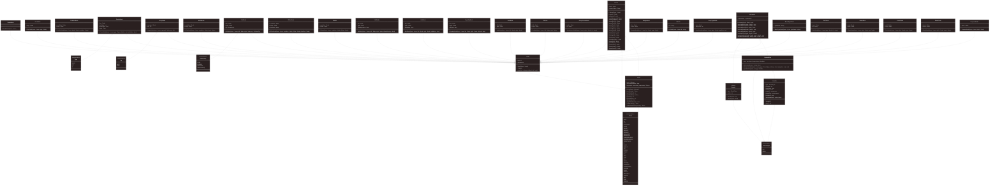

```mermaid
---
config:
  theme: neo-dark
---
classDiagram
    class Token {
        <<enumeration>>
        NUM
        ID
        INT
        BOOLEAN
        TRUE
        FALSE
        LBRACE
        RBRACE
        LBRACKET
        RBRACKET
        LPARENTHESIS
        RPARENTHESIS
        SEMICOLON
        IF
        ELSE
        WHILE
        DO
        BREAK
        PRINT
        EQ
        NEQ
        AND
        OR
        LESS
        LESSEQ
        GREATER
        GREATEREQ
        ASSIGN
        PLUS
        MINUS
        MULTIPLY
        DIVIDE
        NOT
        END
        ERROR
    }

    class Lexer {
        + Lexer(input : ifstream)
        + nextToken() Token
        + getNumber() int
        + getIdentifier() string
        + getLine() int
        + getColumn() int
        - advance() void
        - skipWhiteSpace() void
        - scanNumber() Token
        - scanIdentifierOrKeyword() Token
        - input : ifstream
        - currentCharacter : char
        - keywords : unordered_map&lt;string, Token&gt;
    }
    
    class Node {
        + Node(lexer : Lexer)
        + ~Node()
        + print(out : ostream, indent : int) void
        + line: int
        + column: int
    }
    class ProgramNode {
        + ProgramNode(lexer : Lexer, block : Node)
        + block : Node
    }
    class BlockNode {
        + BlockNode(lexer : Lexer, decls : Node, stmts : Node)
        + decls : Node
        + stmts : Node
    }
    class DeclsNode {
        + DeclsNode(lexer : Lexer, decl : Node, next : Node)
        + decl : Node
        + next : Node
    }
    class StmtsNode {
        + StmtsNode(lexer : Lexer, stmt : Node, next: Node)
        + stmt : Node
        + next : Node
    }
    class DeclNode {
        + DeclNode(lexer : Lexer, type : Node, id : string)
        + type : Node
        + id : string
    }
    class BasicTypeNode {
        + BasicTypeNode(lexer : Lexer, typeName : string)
        + typeName : string
    }
    class ArrayTypeNode {
        + ArrayTypeNode(lexer : Lexer, type : Node, arraySize : int)
        + type : Node
        + arraySize : int
    }
    class IdNode {
        + IdNode(lexer : Lexer, id : string)
        + id : string
    }
    class AssignNode {
        + AssignNode(lexer : Lexer, loc : Node, expr : Node)
        + loc : Node
        + expr : Node
    }
    class ArrayAccessNode {
        + ArrayAccessNode(lexer : Lexer, index : Node, id : string)
        + index : Node
        + id : string
    }
    class OrNode {
        + OrNode(lexer : Lexer, left : Node, right : Node)
        + left : Node
        + right : Node
    }
    class AndNode {
        + AndNode(lexer : Lexer, left : Node, right : Node)
        + left : Node
        + right : Node
    }
    class EqualityNode {
        + EqualityNode(lexer : Lexer, left : Node, right : Node, isEqual : bool)
        + left : Node
        + right : Node
        + isEqual : bool
    }
    class RelationOp {
        <<enumeration>>
        LESS
        LESSEQ
        GREATER
        GREATEREQ
    }
    class RelNode {
        + RelNode(lexer : Lexer, left : Node, right : Node, op : RelationOp)
        + left : Node
        + right : Node
        + op : RelationOp
    }
    class AddNode {
        + AddNode(lexer : Lexer, left : Node, right : Node, isAddition : bool)
        + left : Node
        + right : Node
        + isAddition : bool
    }
    class MulNode {
        + MulNode(lexer : Lexer, left : Node, right : Node, isMultiplication : bool)
        + left : Node
        + right : Node
        + isMultiplication : bool
    }
    class Op {
        <<enumeration>>
        NOT
        NEG
    }
    class UnaryNode {
        + UnaryNode(lexer : Lexer, operand : Node, op : Op)
        + operand : Node
        + op : Op
    }
    class Type {
        <<enumeration>>
        BOOL
        INT
        ID
    }
    class FactorNode {
        + FactorNode(lexer : Lexer, type : Type, intValue : int, boolValue : bool)
        + loc : Node
        + intValue : int
        + boolValue : bool
        + type : Type
    }
    class IfNode {
        + IfNode(lexer : Lexer, condition : Node, ifStmt : Node)
        + condition : Node
        + ifStmt : Node
    }
    class IfElseNode {
        + IfElseNode(lexer : Lexer, condition : Node, ifStmt : Node, elseStmt : Node)
        + condition : Node
        + ifStmt : Node
        + elseStmt : Node
    }
    class WhileNode {
        + WhileNode(lexer : Lexer, condition : Node, body : Node)
        + condition : Node
        + body : Node
    }
    class DoWhileNode {
        + DoWhileNode(lexer : Lexer, body : Node, condition : Node)
        + condition : Node
        + body : Node
    }
    class PrintNode {
        + PrintNode(lexer : Lexer, expr : Node)
        + expr : Node
    }
    class BreakNode {
        + BreakNode(lexer : Lexer)
    }
    
    class Parser {
        + Parser(lexer : Lexer)
        + parse() Node
        - advance() void
        - match(expected: Token)
        - parseProgram() Node
        - parseBlock() Node
        - parseDecls() Node
        - parseDecl() Node
        - parseType() Node
        - parseBasic() Node
        - parseStmts() Node
        - parseStmt() Node
        - parseLoc() Node
        - parseBool() Node
        - parseJoin() Node
        - parseEquality() Node
        - parseRel() Node
        - parseExpr() Node
        - parseTerm() Node
        - parseUnary() Node
        - parseFactor() Node
        - lexer : Lexer
        - currentToken : Token
    }
    class ResultType {
        <<enumeration>>
        INT
        BOOL
    }
    class Result {
        <<struct>>
        + Result(value : int)
        + Result(value : bool)
        + type : ResultType
        + value : int
    }
    class Variable {
        + Variable()
        + size() int
        + type : ResultType
        + intValue : int
        + boolValue : bool
        + isArray : bool
        + intArray : vector&lt;int&gt;
        + boolArray : vector&lt;bool&gt;
        + initialized : bool
        + arrayInitialized : vector&lt;bool&gt;
    }
    class SymbolMap {
        + isDeclared(name : string) bool
        + declareVariable(name : string, type : ResultType, isArray : bool, arraySize : int) void
        + getVariable(name : string) Variable
        - map : unordered_map&lt;string, Variable&gt;
    }
    class Interpreter {
        + interpret(node : Node) void
        - executeBlock(node : Node) void
        - executeDecls(node : Node) void
        - executeDecl(node : Node) void
        - executeStmts(node : Node) void
        - executeStmt(node : Node) void
        - evaluateExpr(node : Node) Result
        - assignValue(locNode : Node, node : Node) void
        - throwError(message : string, node : Node) void
        - symbolMap : SymbolMap
    }

    subgraph Lexer 
        Lexer o-- Token
    
    subgraph Parser 
        Parser o-- Lexer
        Parser o-- Token
        Parser --> Node
    
    subgraph Nodes
        Node --> Lexer 
        ProgramNode --|> Node
        BlockNode --|> Node
        DeclsNode --|> Node
        StmtsNode --|> Node
        DeclNode --|> Node
        BasicTypeNode --|> Node
        ArrayTypeNode --|> Node
        IdNode --|> Node
        AssignNode --|> Node
        ArrayAccessNode --|> Node
        OrNode --|> Node
        AndNode --|> Node
        EqualityNode --|> Node
        RelNode --|> Node
        AddNode --|> Node
        MulNode --|> Node
        UnaryNode --|> Node
        FactorNode --|> Node
        IfNode --|> Node
        IfElseNode --|> Node
        WhileNode --|> Node
        DoWhileNode --|> Node
        PrintNode --|> Node
        BreakNode --|> Node
        RelNode o-- RelationOp
        UnaryNode o-- Op
        FactorNode o-- Type

    subgraph Interpreter
        Result o-- ResultType
        Variable o-- ResultType
        SymbolMap o-- Variable
        SymbolMap --> ResultType
        Interpreter o-- SymbolMap
        Interpreter --> Node
        Interpreter --> Result

```